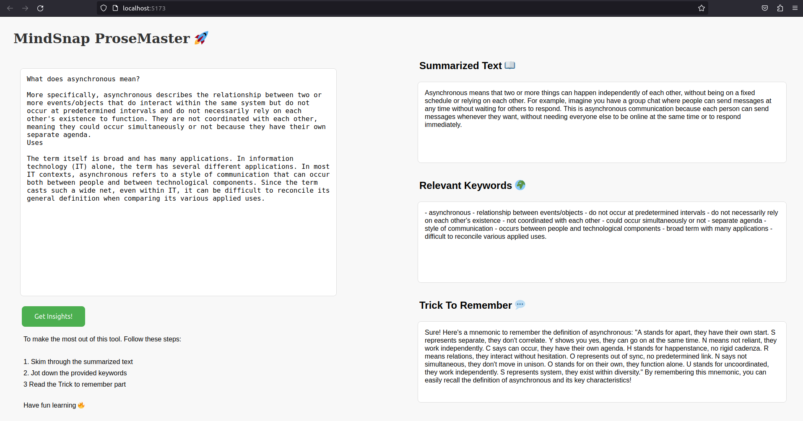

# <p align="center">Welcome to MindSnap ProseMaster, your friendly study companion! 🚀</p>

<p align="center">
    
</p>

<p align="center">
    <p align="center">
        <a href="https://github.com/Ujj1225/MindSnap-ProseMaster" target="blank">
            
        </a>
        <a href="https://github.com/Ujj1225/MindSnap-ProseMaster/fork" target="blank">
            
        </a>
        <a href="https://github.com/Ujj1225/MindSnap-ProseMaster/stargazers" target="blank">
            
        </a>
    </p>
    <p align="center">
        <a href="https://github.com/Ujj1225/MindSnap-ProseMaster/issues" target="blank">
            
        </a>
        <a href="https://github.com/Ujj1225/MindSnap-ProseMaster/pulls" target="blank">
            
        </a>
    </p>
    <p align="center">
        <a href="https://github.com/Ujj1225/MindSnap-ProseMaster/blob/master/LICENSE" target="blank">
            
        </a>
    </p>
</p>

[MindSnap-Prosemaster](https://github.com/Ujj1225/MindSnap-ProseMaster) is your secret sauce for transforming lengthy texts into bite-sized brilliance. Powered by OpenAI's magical API, it crafts clear summaries, essential keywords, and fun mnemonics, making learning a breeze!

[MindSnap-Prosemaster](https://github.com/Ujj1225/MindSnap-ProseMaster) streamlines the learning process, making it more efficient and accessible.

## Table of Contents

- [Features](#features)
- [Demo](#demo)
- [Installation](#installation)
- [Usage](#usage)
- [Dependencies](#dependencies)
- [Contributing](#contributing)
- [License](#license)

## Features

- **Summarizer**: Condenses lengthy texts into concise, digestible summaries.
- **Keyword Whiz**: Extracts and defines essential keywords for easy understanding.
- **Memory Lane**: Crafts mnemonic stories for quick and enjoyable information retention.

## Demo


## Installation

### Prerequisites

Ensure you have Node installed on your system. You can download it from node.js.

Before running MindSnap-ProseMaster, you will need an OpenAI API key if the project utilizes OpenAI's services. You can obtain an API key by registering on the OpenAI platform.

### Setup

1. Clone the repository:

```bash
git clone git@github.com:Ujj1225/MindSnap-ProseMaster.git
```

2. Navigate to the cloned directory:

```bash
cd MindSnap-ProseMaster
```
   Navigate to server side by: 

```bash
cd server 
```

   Navigate to client side by: 

```bash
cd client
```


3. Install the required dependencies:

For both server and client side:

```bash
npm i
```

4. Add your OpenAI API key in [OPENAI_API_KEY](./server/.env) file.

## Usage

Run the application by executing both client and server side code:

For Server side:

```bash
node app.js
```

For Client side:

```bash
npm run dev
```

## Dependencies

- OpenAI API
- cors
- Other dependencies listed in `package.json` (Check out for both Client and server side!)

## Contributing

We welcome contributions to enhance and improve [MindSnap-ProseMaster](https://github.com/Ujj1225/MindSnap-ProseMaster)! Feel free to submit issues, feature requests, or pull requests. Please adhere to our Code of Conduct.

## License

This project is licensed under the [MIT License](/LICENSE).
